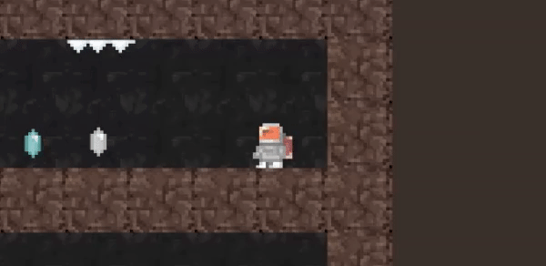

# Super Jetroid

Super Jetroid is one of the games I created while studying 'Become a Unity 2D Developer' learning path on LinkedIn Learning. 

The learning path got me familiar with Unity and expanded my knowledge into game development specifics, including working with controller input, tile maps, and sound, and managing multiple scenes. Following along, it showed me how to import and optimize existing artwork as sprites and create game elements such as players, collectables, obstacles, and enemies driven by basic AI. It also showed how to build a simple splash screen and connect to your game. 

Here is a .gif of the latest build:

# What I Learnt

- Optimizing sprites and draw cells
- Cutting up sprite sheets
- Building animations
- Changing animations
- Creating a player
- Moving the player
- Building a level with a simple map
- Creating interactive objects
- Creating alien enemies
- Switching between scenes
